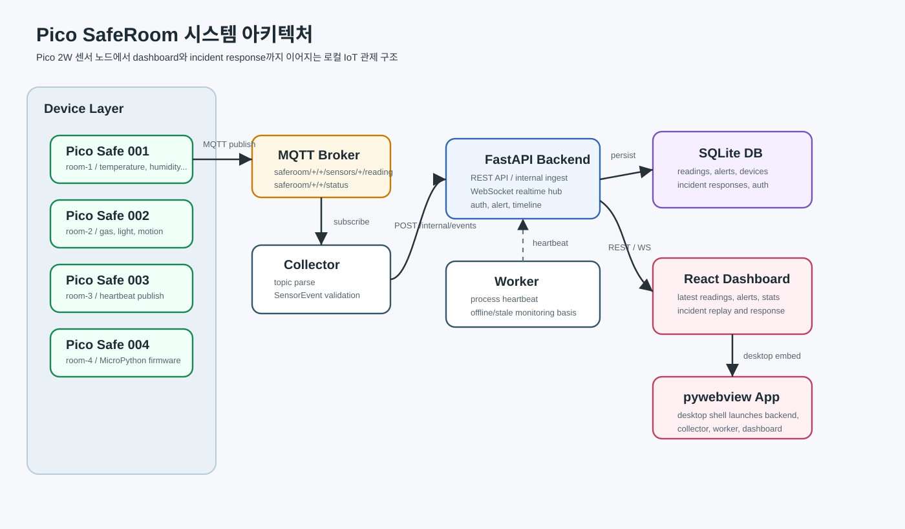
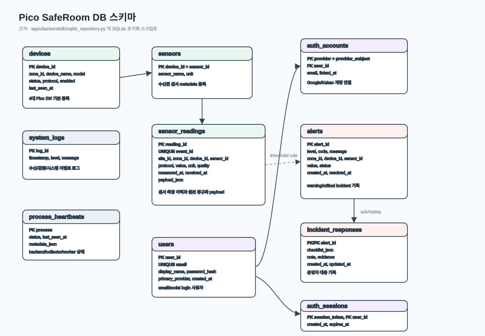
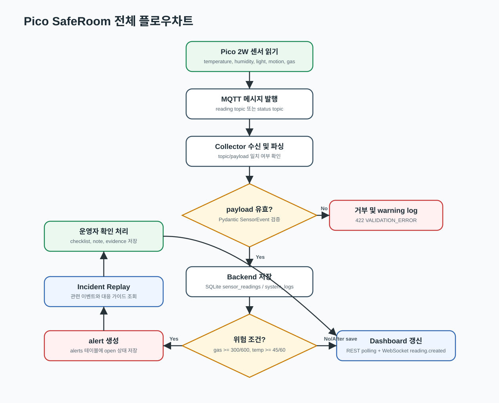

# 프로젝트 기술서

## 1. 프로젝트명

**Pico SafeRoom: 스마트 실내 환경 안전 관제 시스템**

Raspberry Pi Pico 2W 기반 센서 노드가 실내의 온도, 습도, 조도, 움직임, 가스/연기 데이터를 수집하고, MQTT collector와 FastAPI backend를 거쳐 React/Vite dashboard와 pywebview desktop app에서 실시간 관제하는 로컬 IoT 안전 관제 시스템이다.

## 2. 수행기간

| 구분 | 내용 |
| --- | --- |
| 기준 기간 | 2026.06.01 ~ 2026.06.05 기준 작성 |
| 주요 수행 내용 | Pico 2W MicroPython firmware, MQTT collector, FastAPI backend, SQLite 저장소, React dashboard, pywebview launcher, alert/replay/response 기능 구현 |
| 문서 기준일 | 2026.06.05 |

## 3. 담당역할
실제 제출 시 팀원명만 교체해 사용할 수 있도록 역할 중심으로 정리한다.

| 담당 영역 | 역할 | 주요 산출물 |
| --- | --- | --- |
| Device / Firmware | Pico 2W 펌웨어, 실제 센서 배선, MQTT publish | `firmware/pico2w/main.py`, `firmware/pico2w/sensors.py`, 센서 배선 문서 |
| Collector | MQTT subscribe, topic parsing, payload validation, backend 전달 | `apps/collector/mqtt_client.py`, `apps/collector/mqtt_parser.py` |
| Backend / DB | REST API, internal ingest API, SQLite schema, alert/replay 처리 | `apps/backend/main.py`, `apps/backend/db/sqlite_repository.py` |
| Worker / Runtime | process heartbeat, multi-process 실행 구조, stale/offline 판단 기반 | `apps/worker/main.py`, `apps/desktop/app.py` |
| Frontend / Desktop | React dashboard, WebSocket 실시간 갱신, incident response UI, pywebview 실행 | `frontend/src/App.tsx`, `frontend/src/IncidentResponsePanel.tsx` |
| QA / Docs | 테스트, 설치 문서, 발표 시나리오, 기술서 작성 | `tests/`, `README.ko.md`, `SETUP.ko.md`, 본 기술서 |

## 4. 수행목표

- Pico 2W 4대를 `room-1`부터 `room-4`까지의 실내 안전 센서 노드로 구성한다.
- 각 Pico는 온도, 습도, 조도, 움직임, 가스 센서값과 heartbeat를 MQTT topic으로 발행한다.
- Collector는 MQTT 메시지를 수신해 표준 `SensorEvent` 또는 `DeviceHeartbeat` schema로 변환한다.
- Backend는 sensor reading, device/process heartbeat, alert, incident response, auth session을 SQLite에 저장한다.
- Dashboard는 최신 센서값, 장치 상태, 시스템 상태, 통계, alert, timeline, incident replay를 표시한다.
- 위험 상황 발생 시 단순 표시에서 끝나지 않고, 대응 checklist, operator note, evidence를 저장해 incident response demo로 확장한다.

## 5. 사용 기술

| 구분 | 사용 기술 |
| --- | --- |
| 하드웨어 | Raspberry Pi Pico 2W 4대, 온습도 센서, 조도 센서, PIR motion sensor, gas/smoke sensor |
| Firmware | MicroPython, GPIO, ADC, Wi-Fi, MQTT publish |
| 통신 | MQTT, HTTP internal API, REST API, WebSocket |
| Backend | Python, FastAPI, Uvicorn, Pydantic |
| Database | SQLite |
| Frontend | React, Vite, TypeScript |
| Desktop | pywebview |
| Auth | email/password session, Google/Kakao OAuth callback 구조 |
| Test / Tool | pytest, npm build, Git, GitHub, VS Code |

## 6. 세부수행내용

### 6.1 목적

실내 공간의 안전 상태를 센서 데이터 기반으로 수집, 저장, 분석, 표시하는 시스템을 구현한다. 기존 단순 IoT dashboard와 달리 alert 발생 이후의 replay, 대응 가이드, checklist, note, evidence까지 함께 남겨 실제 관제 업무 흐름에 가까운 시연을 목표로 한다.

### 6.2 개발 환경

- Python 3.11 가상환경
- FastAPI backend와 SQLite database
- React/Vite frontend build
- pywebview desktop launcher
- MQTT broker와 Pico 2W 또는 simulator
- 실제 실행 명령은 `README.ko.md`, `SETUP.ko.md`, `firmware/pico2w/README.ko.md` 기준으로 운영한다.

### 6.3 주요 기능

- 4개 방 기준 Pico 2W device registry
- 온도, 습도, 조도, 움직임, 가스 센서값 수집
- MQTT reading topic, device status topic 수신
- payload topic 일치 검증 및 `SensorEvent` 정규화
- 센서 최신값과 history 조회
- 가스/온도 threshold 기반 warning/critical alert 생성
- stale sensor와 device offline 상태 표시
- REST polling과 WebSocket 기반 dashboard 갱신
- alert guidance, replay, report, acknowledgement 처리
- operator checklist, note, evidence 저장
- email/password login과 social OAuth callback 기반 사용자 인증 구조

### 6.4 시스템 구성



| 구성요소 | 설명 |
| --- | --- |
| Pico 2W Sensor Node | 각 방의 센서값과 heartbeat를 MQTT로 발행한다. |
| MQTT Broker | `saferoom/+/+/sensors/+/reading`, `saferoom/+/+/status` topic을 중계한다. |
| Collector Process | MQTT 메시지를 subscribe하고 topic/payload를 검증한 뒤 backend internal API로 전달한다. |
| Backend Process | REST API, WebSocket, internal ingest API, SQLite 저장, alert 판단을 담당한다. |
| Worker Process | process heartbeat를 주기적으로 전송하고 runtime 상태 감시의 기반 역할을 한다. |
| SQLite DB | 장치, 센서값, alert, incident response, process heartbeat, auth 데이터를 저장한다. |
| React Dashboard | 안전 상태, 최신 센서값, alert, timeline, 통계, incident response 화면을 제공한다. |
| pywebview App | backend, collector, worker, dashboard를 데스크톱 앱 형태로 실행한다. |

### 6.5 하드웨어 구성

| 장치 | Device ID | Zone | 역할 |
| --- | --- | --- | --- |
| Pico 1 | `pico-safe-001` | `room-1` | 실내 센서 노드 |
| Pico 2 | `pico-safe-002` | `room-2` | 실내 센서 노드 |
| Pico 3 | `pico-safe-003` | `room-3` | 실내 센서 노드 |
| Pico 4 | `pico-safe-004` | `room-4` | 실내 센서 노드 |

센서 구성은 발표 환경에 따라 실제 센서 또는 simulator를 사용할 수 있다. 실제 펌웨어와 simulator는 같은 payload schema를 유지해 backend와 dashboard 구조를 바꾸지 않는다.

### 6.6 MQTT Topic 및 Payload

센서값 topic:

```text
saferoom/{zone_id}/{device_id}/sensors/{sensor_id}/reading
```

Heartbeat topic:

```text
saferoom/{zone_id}/{device_id}/status
```

센서값 payload 예시:

```json
{
  "device_id": "pico-safe-001",
  "zone_id": "room-1",
  "sensor_id": "gas",
  "value": 601,
  "unit": "ppm",
  "timestamp": "2026-06-05T10:00:00+09:00",
  "seq": 1024
}
```

Collector는 topic과 payload의 `zone_id`, `device_id`, `sensor_id`가 일치하는지 확인하고, backend에는 다음 내부 schema로 전달한다.

```json
{
  "event_id": "uuid",
  "site_id": "safe-room-lab",
  "zone_id": "room-1",
  "device_id": "pico-safe-001",
  "sensor_id": "gas",
  "protocol": "mqtt",
  "value": 601,
  "unit": "ppm",
  "timestamp": "2026-06-05T10:00:00+09:00",
  "quality": "good",
  "trace_id": "uuid",
  "metadata": {
    "topic": "saferoom/room-1/pico-safe-001/sensors/gas/reading",
    "seq": 1024
  }
}
```

### 6.7 Backend API

| Method | Path | 역할 |
| --- | --- | --- |
| `GET` | `/api/health` | backend 상태, safety state, process 상태 조회 |
| `GET` | `/api/stats` | 전체 통계, 장치/센서/alert breakdown 조회 |
| `GET` | `/api/readings/latest` | 장치별 최신 센서값 조회 |
| `GET` | `/api/readings/history` | 센서 이력 조회 |
| `GET` | `/api/devices` | device registry와 online/offline 상태 조회 |
| `GET` | `/api/liveness` | device/process liveness 조회 |
| `GET` | `/api/timeline` | reading, alert, log, heartbeat timeline 조회 |
| `GET` | `/api/alerts` | alert 목록 조회 |
| `GET` | `/api/alerts/{alert_id}/replay` | 특정 alert 관련 이벤트와 대응 가이드 조회 |
| `GET` | `/api/alerts/{alert_id}/report` | incident report 형태의 요약 조회 |
| `POST` | `/api/alerts/{alert_id}/ack` | checklist, note, evidence와 함께 alert 확인 처리 |
| `POST` | `/internal/events` | collector가 sensor event를 전달 |
| `POST` | `/internal/heartbeats/device` | device heartbeat ingest |
| `POST` | `/internal/heartbeats/process` | process heartbeat ingest |
| `WS` | `/ws/realtime` | `reading.created` 실시간 broadcast |

## 7. DB 스키마



| Table | 설명 |
| --- | --- |
| `devices` | Pico 2W device registry와 online/offline 계산 기준 |
| `sensors` | device별 sensor metadata |
| `sensor_readings` | 정규화된 센서 측정 이력과 원본 payload JSON |
| `system_logs` | 수신, 검증 실패, heartbeat 등 시스템 로그 |
| `alerts` | warning/critical alert 이력 |
| `incident_responses` | alert 확인 시 checklist, note, evidence 저장 |
| `process_heartbeats` | backend, collector, worker process 상태 |
| `users` | email/social login 사용자 |
| `auth_accounts` | Google/Kakao 등 social provider 계정 연결 |
| `auth_sessions` | session cookie 기반 로그인 유지 |

## 8. 핵심 코드

### 8.1 MQTT topic parsing

`apps/collector/mqtt_parser.py`는 reading topic을 6개 segment로 분해하고, `saferoom/{zone}/{device}/sensors/{sensor}/reading` 형식이 아니면 `MQTTTopicError`를 발생시킨다. 또한 payload 안의 `zone_id`, `device_id`, `sensor_id`가 topic과 다르면 거부한다. 이 로직은 잘못된 장치나 센서 데이터가 DB에 저장되는 것을 막는 1차 방어선이다.

### 8.2 SensorEvent 저장과 alert 생성

`apps/backend/db/sqlite_repository.py`의 `add_event`는 수신된 `SensorEvent`를 `sensor_readings`에 저장하고, 동시에 `system_logs`를 남긴다. 저장된 값이 가스 또는 온도 threshold를 넘으면 `alerts`에 warning/critical alert를 생성한다.

### 8.3 Incident response

`POST /api/alerts/{alert_id}/ack`는 alert 상태를 `acknowledged`로 바꾸고, checklist, note, evidence를 `incident_responses`에 저장한다. `GET /api/alerts/{alert_id}/replay`와 `GET /api/alerts/{alert_id}/report`는 alert와 관련 timeline, 대응 가이드, 운영자 대응 기록을 함께 보여준다.

### 8.4 Dashboard realtime

Frontend는 REST API로 주기적인 상태를 조회하고, WebSocket `/ws/realtime`을 통해 새 sensor reading을 즉시 반영한다. 네트워크나 backend 상태가 불안정한 경우 dashboard는 reconnecting/offline 상태를 표시한다.

## 9. 전체 플로우차트



### 동작 순서

1. Pico 2W가 센서값을 읽고 MQTT reading topic으로 발행한다.
2. Collector가 MQTT topic을 subscribe하고 payload를 파싱한다.
3. topic과 payload가 일치하면 `SensorEvent`로 정규화해 `/internal/events`로 전달한다.
4. Backend가 Pydantic schema 검증 후 SQLite에 저장한다.
5. gas 또는 temperature 값이 threshold를 넘으면 alert를 생성한다.
6. Dashboard는 REST API와 WebSocket으로 최신값, alert, timeline을 갱신한다.
7. 운영자는 alert replay를 확인하고 checklist, note, evidence를 입력해 대응 기록을 남긴다.

## 10. 시연 시나리오

1. MQTT broker와 backend를 실행한다.
2. pywebview desktop app 또는 browser mode로 dashboard를 연다.
3. 실제 Pico 2W 또는 simulator가 센서값을 전송한다.
4. dashboard에서 room별 센서값, WebSocket 상태, process 상태를 확인한다.
5. gas 값을 warning 또는 critical threshold 이상으로 전송해 alert를 발생시킨다.
6. alert replay 화면에서 관련 timeline과 대응 가이드를 확인한다.
7. checklist, note, evidence를 입력해 alert를 acknowledged 상태로 변경한다.
8. `/api/stats` 또는 dashboard statistics 화면에서 전체 상태와 alert breakdown을 확인한다.

## 11. 기대 효과

- Pico 2W, MQTT, backend, DB, desktop dashboard를 하나의 end-to-end 구조로 연결한다.
- micro-architecture 기반으로 collector, backend, worker, UI 책임을 분리해 장애 지점과 확장 지점을 명확히 설명할 수 있다.
- 단순 센서값 표시가 아니라 incident replay와 guided response를 포함해 안전 관제 시스템다운 차별점을 만든다.
- simulator와 실제 Pico firmware가 같은 payload schema를 사용하므로 개발, 테스트, 발표 환경을 유연하게 전환할 수 있다.

## 12. 참조

- GitHub repository: `https://github.com/Gwiin/hrd_second_project`
- 프로젝트 안내: `README.ko.md`
- 설치 및 실행: `SETUP.ko.md`
- 중간 기술 브리프: `docs/midterm-technical-brief-2026-06-04.md`
- Backend API: `apps/backend/main.py`
- SQLite schema: `apps/backend/db/sqlite_repository.py`
- MQTT parser: `apps/collector/mqtt_parser.py`
- Sensor schema: `shared/schemas/sensor_event.py`
