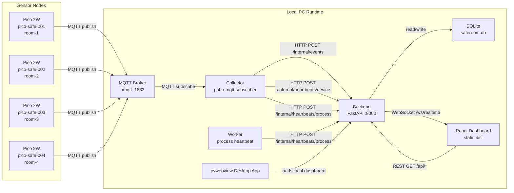
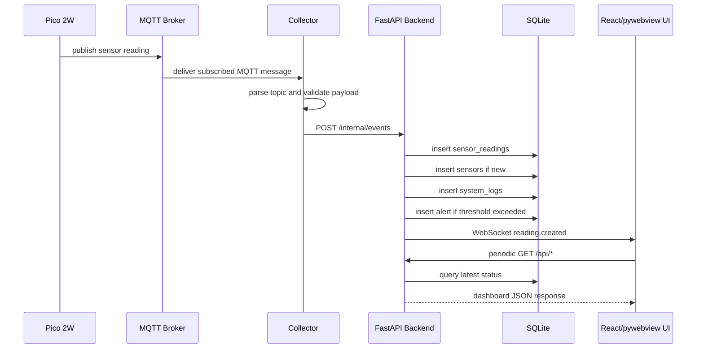
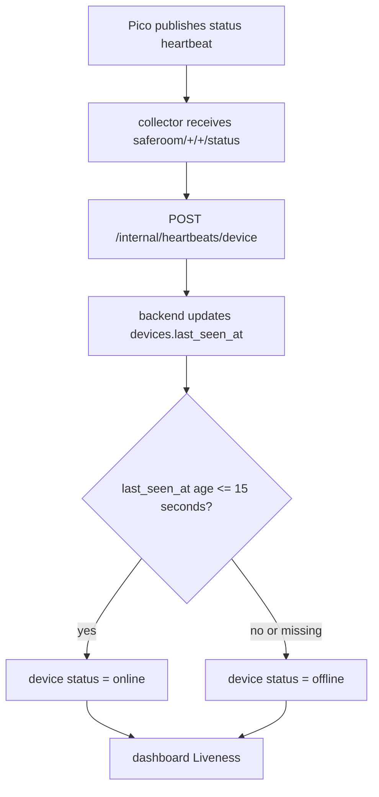
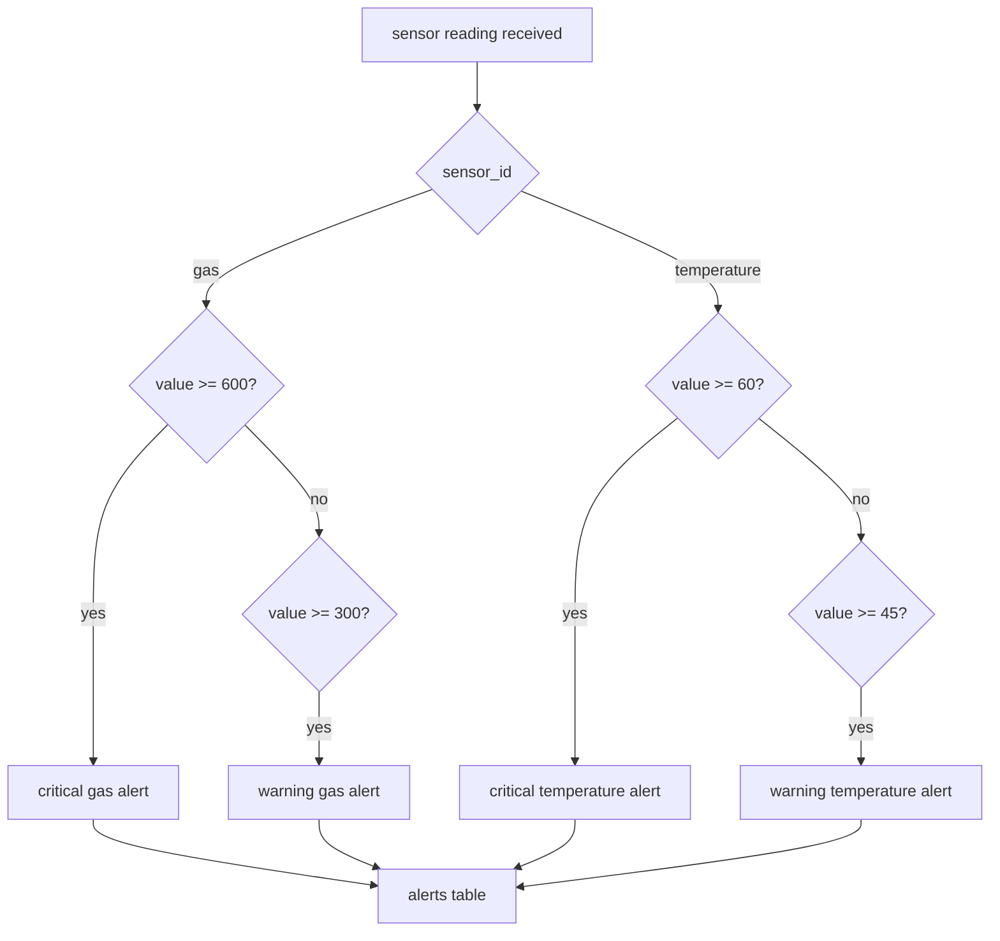
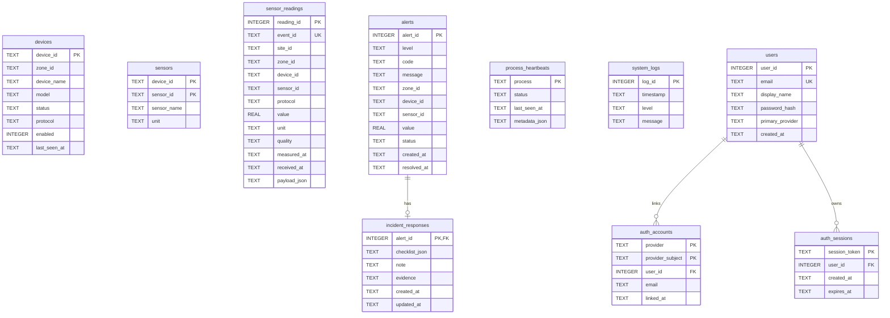
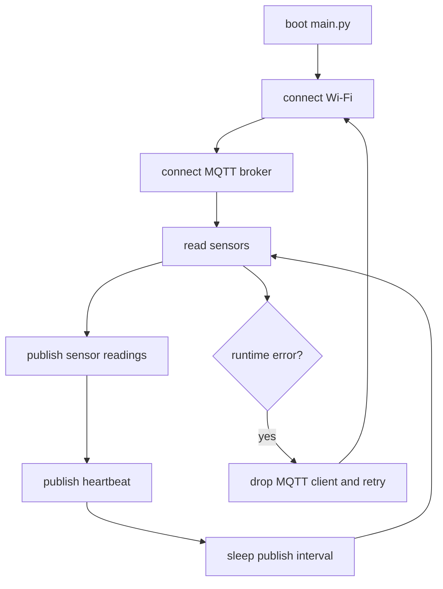
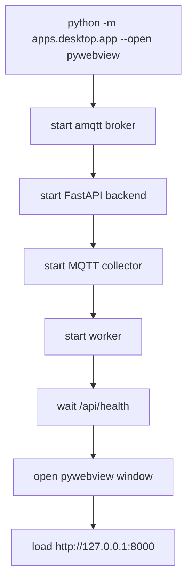

# Pico SafeRoom 중간점검 기술 설명서

작성일: 2026-06-04  
문서 목적: 중간점검 발표에서 프로젝트의 목적, 기술 스택, 통신 구조, 동작 방식, 시스템 아키텍처, DB 스키마를 설명하기 위한 자료

## 1. 프로젝트 개요

Pico SafeRoom은 Raspberry Pi Pico 2W 기반의 실시간 실내 안전 모니터링 시스템이다.  
각 방에 설치된 Pico 2W가 온도, 습도, 조도, 움직임 같은 센서 데이터를 MQTT로 전송하고, PC에서 실행되는 서버가 데이터를 수집, 저장, 분석한 뒤 웹 대시보드와 데스크톱 앱 형태로 보여준다.

현재 목표 구성은 Pico 2W 4대와 4개 구역이다.

| 장치 | 담당 구역 | 역할 |
|---|---|---|
| pico-safe-001 | room-1 | 1번 방 센서 노드 |
| pico-safe-002 | room-2 | 2번 방 센서 노드 |
| pico-safe-003 | room-3 | 3번 방 센서 노드 |
| pico-safe-004 | room-4 | 4번 방 센서 노드 |

핵심 기능은 다음과 같다.

- Pico 2W 실물 보드에서 센서값 수집
- MQTT 기반 센서 데이터 전송
- collector 프로세스가 MQTT 메시지를 backend 내부 API로 전달
- FastAPI backend가 SQLite에 센서값, 알림, 로그, heartbeat 저장
- React dashboard가 최신 센서값, 안전 상태, liveness, timeline 표시
- WebSocket으로 새 센서 이벤트를 실시간 반영
- pywebview를 사용해 웹 대시보드를 데스크톱 프로그램처럼 실행
- gas, temperature 임계값 기반 alert 생성
- alert replay와 guided response로 사고 대응 흐름 기록

## 2. 기술 스택과 선택 이유

| 영역 | 기술 | 사용 위치 | 선택 이유 |
|---|---|---|---|
| IoT 보드 | Raspberry Pi Pico 2W | `firmware/pico2w` | Wi-Fi 내장, MicroPython 사용 가능, 센서 실습에 적합하고 가격이 낮음 |
| 펌웨어 | MicroPython | Pico 2W | Python 문법으로 빠르게 센서 제어와 MQTT publish 구현 가능 |
| 메시징 | MQTT | Pico -> broker -> collector | IoT 센서 데이터에 적합한 경량 publish/subscribe 프로토콜 |
| MQTT broker | amqtt | 로컬 PC `data/amqtt.yml` | Python 가상환경에서 실행 가능해서 별도 Mosquitto 설치 실패 상황에서도 로컬 개발 가능 |
| MQTT client | paho-mqtt | `apps/collector/mqtt_client.py` | Python에서 MQTT subscribe 구현이 안정적이고 사용법이 단순함 |
| Backend API | FastAPI | `apps/backend/main.py` | Pydantic 검증, REST API, WebSocket을 한 프로젝트에서 빠르게 구성 가능 |
| 데이터 검증 | Pydantic | `shared/schemas` | 센서 이벤트와 heartbeat payload의 필드를 명확히 검증 가능 |
| DB | SQLite | `data/saferoom.db` | 로컬 데모와 중간 발표 단계에 적합하며 설치와 운영 부담이 작음 |
| Frontend | React + TypeScript | `frontend/src/App.tsx` | 상태 기반 UI, 타입 안정성, 컴포넌트 구조에 적합 |
| Build tool | Vite | `frontend/package.json` | 빠른 개발 서버와 간단한 production build |
| Desktop wrapper | pywebview | `apps/desktop/app.py` | 기존 웹 대시보드를 별도 UI 재작성 없이 데스크톱 앱처럼 실행 가능 |
| HTTP client | httpx | collector, worker | Python 내부 프로세스가 FastAPI로 데이터 전송하기 적합 |
| 테스트 | pytest, TypeScript build | `tests`, `frontend` | backend, collector, firmware 로직, desktop launcher를 자동 검증 |

기술 선택의 큰 방향은 "실물 IoT 데이터는 MQTT로 가볍게 받고, PC 쪽은 Python/FastAPI로 빠르게 안정화하며, 화면은 React로 풍부하게 구성한다"이다. SQLite와 amqtt를 사용한 이유는 중간점검 단계에서 서버 설치 부담을 줄이고 한 PC에서 전체 시스템을 재현하기 위해서다.

## 3. 전체 시스템 아키텍처



## 4. 프로세스 구성

로컬 PC에서 실행되는 주요 프로세스는 네 가지다.

| 프로세스 | 역할 | 포트/통신 |
|---|---|---|
| amqtt broker | Pico가 publish하는 MQTT 메시지를 받음 | TCP `0.0.0.0:1883` |
| backend | REST API, WebSocket, DB 저장, alert 판정 | HTTP `127.0.0.1:8000` |
| collector | MQTT topic subscribe 후 backend 내부 API로 전달 | MQTT subscribe, HTTP POST |
| worker | 백그라운드 작업자 상태 heartbeat 전송 | HTTP POST |

pywebview 실행 시 `apps/desktop/app.py`가 위 프로세스들을 순서대로 실행하고, backend 준비가 끝나면 `Pico SafeRoom` 창을 띄워 `http://127.0.0.1:8000`을 표시한다.

## 5. 통신 방식

### 5.1 Pico -> MQTT broker

Pico 펌웨어는 Wi-Fi에 연결한 뒤 MQTT broker로 접속한다. 현재 펌웨어 설정은 `firmware/pico2w/config.py`에 있으며, 예시는 다음 구조다.

| 설정 | 의미 |
|---|---|
| `WIFI_SSID`, `WIFI_PASSWORD` | Pico가 접속할 Wi-Fi |
| `MQTT_HOST`, `MQTT_PORT` | MQTT broker가 실행되는 PC IP와 포트 |
| `DEVICE_ID` | Pico 장치 ID |
| `ZONE_ID` | 담당 방 ID |
| `PUBLISH_INTERVAL_SECONDS` | 센서 publish 주기 |

Pico는 다음 두 종류의 MQTT topic을 사용한다.

| 메시지 | Topic 형식 | 설명 |
|---|---|---|
| 센서값 | `saferoom/{zone_id}/{device_id}/sensors/{sensor_id}/reading` | 온도, 습도, 조도, 움직임 등 센서 reading |
| 장치 상태 | `saferoom/{zone_id}/{device_id}/status` | 장치 online heartbeat |

센서 payload 예시는 다음과 같다.

```json
{
  "device_id": "pico-safe-004",
  "zone_id": "room-4",
  "sensor_id": "temperature",
  "value": 24.5,
  "unit": "celsius",
  "timestamp": "2026-06-04T12:00:00+00:00",
  "seq": 1
}
```

장치 heartbeat payload 예시는 다음과 같다.

```json
{
  "device_id": "pico-safe-004",
  "zone_id": "room-4",
  "status": "online",
  "timestamp": "2026-06-04T12:00:00+00:00",
  "uptime_ms": 123456,
  "seq": 1
}
```

### 5.2 MQTT broker -> collector

collector는 다음 topic filter를 subscribe한다.

| Filter | 용도 |
|---|---|
| `saferoom/+/+/sensors/+/reading` | 모든 장치의 센서 reading 수신 |
| `saferoom/+/+/status` | 모든 장치의 heartbeat 수신 |

collector는 topic과 payload가 서로 일치하는지 확인한다. 예를 들어 topic의 `device_id`와 payload의 `device_id`가 다르면 메시지를 backend로 넘기지 않는다. 이 검증은 잘못된 장치 설정이나 잘못된 topic 발행을 찾는 데 도움이 된다.

### 5.3 collector/worker -> backend

collector는 MQTT 메시지를 backend 내부 API로 변환해서 보낸다.

| 호출 주체 | Endpoint | 역할 |
|---|---|---|
| collector | `POST /internal/events` | 센서 reading 저장 |
| collector | `POST /internal/heartbeats/device` | Pico 장치 online 상태 저장 |
| collector | `POST /internal/heartbeats/process` | collector 프로세스 online 상태 저장 |
| worker | `POST /internal/heartbeats/process` | worker 프로세스 online 상태 저장 |

내부 API에서 Pydantic schema가 payload를 검증한다. 검증 실패 시 backend는 `422 VALIDATION_ERROR`를 반환하고, 잘못된 센서 이벤트는 저장하지 않는다.

### 5.4 dashboard/pywebview -> backend

React dashboard는 backend와 같은 origin에서 동작한다. 주요 조회 API는 다음과 같다.

| Endpoint | 화면에서 쓰는 정보 |
|---|---|
| `GET /api/health` | 앱 상태, safety state, uptime, process 상태 |
| `GET /api/devices` | Pico 장치 목록과 online/offline |
| `GET /api/readings/latest` | 장치별 최신 센서값 |
| `GET /api/logs` | 최근 시스템 로그 |
| `GET /api/alerts` | 경고 목록 |
| `GET /api/timeline` | reading, alert, log, heartbeat 통합 타임라인 |
| `GET /api/liveness` | 장치와 프로세스 생존 상태 |
| `WS /ws/realtime` | 새 reading 발생 시 실시간 push |

dashboard는 REST polling으로 전체 상태를 주기적으로 새로고침하고, WebSocket으로 새 센서 이벤트를 즉시 반영한다. WebSocket이 끊기면 reconnect 상태를 표시하고 다시 연결을 시도한다.

## 6. 동작 흐름

### 6.1 정상 센서 데이터 흐름



### 6.2 장치 liveness 흐름



장치 상태는 DB에 저장된 `last_seen_at` 기준으로 계산한다. 현재 기준으로 heartbeat가 없거나 마지막 heartbeat가 15초를 넘으면 offline으로 표시한다. 이 방식은 단순히 초기 등록된 장치를 online으로 보여주는 문제를 줄인다.

### 6.3 alert 생성 흐름



현재 alert 기준은 backend repository에 구현되어 있다.

| 센서 | Warning | Critical |
|---|---:|---:|
| gas | `>= 300 ppm` | `>= 600 ppm` |
| temperature | `>= 45 celsius` | `>= 60 celsius` |

## 7. DB 스키마

DB는 SQLite 파일 `data/saferoom.db`를 사용한다. 테이블은 backend 시작 시 자동 생성된다.



### 주요 테이블 설명

| 테이블 | 목적 |
|---|---|
| `devices` | Pico 장치 4대의 기본 정보와 마지막 heartbeat 시간 저장 |
| `sensors` | 장치별 센서 종류 등록 |
| `sensor_readings` | 실제 센서 이벤트 원본과 정규화된 필드 저장 |
| `alerts` | gas, temperature 임계값 기반 경고 저장 |
| `incident_responses` | 경고 확인 시 작업자 checklist, note, evidence 저장 |
| `process_heartbeats` | collector, worker 같은 백그라운드 프로세스 상태 저장 |
| `system_logs` | reading 수신, heartbeat 수신, 오류 등 시스템 로그 저장 |
| `users` | 이메일/소셜 로그인 사용자 기본 정보 |
| `auth_accounts` | Google/Kakao 같은 소셜 계정 연결 |
| `auth_sessions` | 로그인 세션 토큰 저장 |

## 8. Backend API 구조

외부 대시보드용 API와 내부 수집용 API를 분리했다.

| 구분 | Prefix | 설명 |
|---|---|---|
| Dashboard API | `/api/*` | 화면에서 조회하거나 alert를 처리하는 API |
| Internal ingest API | `/internal/*` | collector, worker가 데이터를 넣는 API |
| Realtime | `/ws/realtime` | 센서 이벤트 실시간 push |

이 분리의 장점은 다음과 같다.

- 화면 조회용 API와 데이터 수집용 API 책임이 명확하다.
- collector가 MQTT 형식을 backend 내부 schema로 변환하므로 backend는 MQTT client를 직접 들고 있지 않아도 된다.
- 추후 broker, collector, backend를 서로 다른 서버로 분리하기 쉽다.

## 9. Frontend 동작 방식

React dashboard는 다음 영역으로 구성된다.

| 화면 영역 | 표시 정보 |
|---|---|
| Topbar | safety state, backend/collector/worker 상태, uptime, realtime 상태 |
| Zones | room-1부터 room-4까지 장치 선택 |
| Latest readings | 선택된 장치의 최신 센서값 |
| Blackbox timeline | reading, alert, log, heartbeat 이벤트 흐름 |
| Incident response | alert guidance, checklist, note/evidence |
| Liveness | Pico 장치와 프로세스 online/offline |
| System log | 최근 수집/상태 로그 |

데이터 갱신은 두 가지 방식이 함께 사용된다.

- REST polling: 약 2.5초마다 `/api/health`, `/api/devices`, `/api/readings/latest`, `/api/alerts`, `/api/timeline`, `/api/liveness` 조회
- WebSocket: 새 센서 reading이 저장되면 `/ws/realtime`으로 즉시 반영

## 10. 펌웨어 동작 방식

Pico 펌웨어의 메인 루프는 다음 순서로 동작한다.



현재 펌웨어는 Wi-Fi나 MQTT 연결이 끊겨도 루프에서 예외를 잡고 다시 연결을 시도한다. 또한 MicroPython 보드에서 `main.py`가 자동 실행될 때도 `run_forever()`가 실행되도록 처리되어 있다.

## 11. 데스크톱 앱 실행 구조

pywebview는 별도 네이티브 UI를 새로 만드는 방식이 아니라, 기존 FastAPI + React dashboard를 로컬 데스크톱 창으로 감싸는 방식이다.

실행 흐름은 다음과 같다.



이 방식을 선택한 이유는 다음과 같다.

- 웹 대시보드 코드를 그대로 재사용할 수 있다.
- 발표나 현장 시연 시 브라우저 주소창 없이 독립 프로그램처럼 보여줄 수 있다.
- backend, broker, collector, worker를 하나의 launcher에서 함께 실행할 수 있다.

## 12. 현재까지 해결한 주요 이슈

| 이슈 | 원인 | 조치 |
|---|---|---|
| Mosquitto 명령어 인식 실패 | Windows에 Mosquitto가 설치되어 있지 않거나 PATH에 없음 | `.venv`의 `amqtt.exe`를 broker로 사용 |
| dashboard에서 미연결 Pico가 online으로 보임 | 초기 등록 장치의 기본 status만 보고 있었음 | `last_seen_at`이 없으면 offline, heartbeat 15초 초과 시 offline 계산 |
| collector/worker가 simulated로 보임 | 프로세스 heartbeat가 실제 실행 상태를 갱신하지 않음 | collector/worker가 `/internal/heartbeats/process`로 online heartbeat 전송 |
| Pico MQTT 연결 불안정 | 연결 끊김 시 재시도 흐름 부족 | 펌웨어 루프에서 Wi-Fi/MQTT 재연결 처리 |
| pywebview 실행 요구 | 웹 앱만 제공되면 데스크톱 프로그램처럼 보이기 어려움 | `apps.desktop.app` launcher와 pywebview 창 추가 |
| 원격 업데이트 병합 필요 | 원격 main 업데이트와 로컬 수정 동시 존재 | 최신 원격 반영 후 로컬 수정 유지 및 테스트 통과 확인 |

## 13. 현재 상태와 남은 작업

현재 구현상 목표 구조는 4대 Pico 실물 보드를 기준으로 동작하도록 맞춰져 있다. 최근 확인된 펌웨어 설정은 `pico-safe-004`, `room-4`이며 MQTT broker 주소는 로컬 PC IP를 사용한다.

남은 작업은 다음과 같다.

- Pico 4대 각각에 고유 `DEVICE_ID`, `ZONE_ID` 펌웨어 업로드 확인
- 4대가 동시에 MQTT broker에 접속하는지 현장 검증
- 센서별 실제 값 범위 보정
- 장치별 heartbeat와 sensor reading이 모두 dashboard에 들어오는지 장시간 테스트
- 운영 환경에서는 MQTT 인증, 내부 API 보호, HTTPS, 로그 보존 정책 검토
- SQLite에서 장기 운영 DB로 이전할지 판단

## 14. 실행 명령 요약

pywebview 기반 통합 실행 순서:

```powershell
cd C:\Users\KOREA_HRD_1_3\Desktop\hrd_second_project
npm.cmd --prefix frontend run build
.\.venv\Scripts\python.exe -m apps.desktop.app --open pywebview
```

브라우저로 열고 싶을 때:

```powershell
.\.venv\Scripts\python.exe -m apps.desktop.app --open browser
```

개별 실행이 필요할 때:

```powershell
.\.venv\Scripts\amqtt.exe -c data\amqtt.yml
.\.venv\Scripts\python.exe -m apps.backend.main
.\.venv\Scripts\python.exe -m apps.collector.mqtt_client --broker-host 127.0.0.1 --broker-port 1883 --backend-url http://127.0.0.1:8000
.\.venv\Scripts\python.exe -m apps.worker.main --backend-url http://127.0.0.1:8000
```

## 15. 발표용 한 문장 요약

Pico SafeRoom은 4대의 Raspberry Pi Pico 2W가 MQTT로 실시간 센서 데이터를 보내고, Python FastAPI backend가 이를 SQLite에 저장 및 alert로 판단하며, React dashboard와 pywebview 데스크톱 앱에서 실시간으로 안전 상태와 사고 대응 흐름을 확인하는 로컬 IoT 안전 모니터링 시스템이다.
