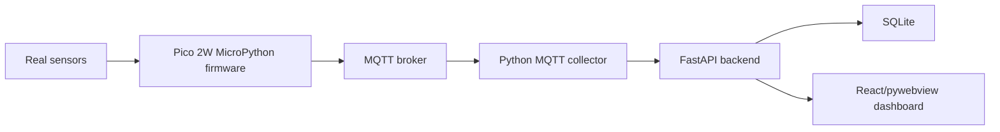

# Pico SafeRoom Real Sensor Firmware Design

## Goal

Build the real Raspberry Pi Pico 2W firmware path for four physical devices while keeping the Python simulator as a separate development tool.

## Language Decision

Use MicroPython for the first real-sensor implementation.

This matches the current technical specification, the existing `firmware/pico2w/` scaffold, and the project need for fast Wi-Fi, MQTT, GPIO, and ADC debugging on classroom hardware. C/C++ with the Pico SDK remains a later option only if the team needs strict timing, lower-level control, RTOS scheduling, or performance beyond periodic sensor publishing.

## Scope

In scope:

- Four Pico 2W device identities:
  - `pico-safe-001` in `room-1`
  - `pico-safe-002` in `room-2`
  - `pico-safe-003` in `room-3`
  - `pico-safe-004` in `room-4`
- Real sensor reading adapters for the existing project sensor IDs:
  - `temperature`
  - `humidity`
  - `light`
  - `motion`
  - `gas`
- MQTT publish compatibility with the existing collector:
  - `saferoom/{zone_id}/{device_id}/sensors/{sensor_id}/reading`
  - `saferoom/{zone_id}/{device_id}/status`
- A separate visual wiring README for the team.
- Simulator separation: `apps/collector/simulator.py` remains a host-side simulator and is not mixed into Pico firmware.

Out of scope for this step:

- Flashing the physical boards from Codex.
- Real calibration values for specific sensor brands.
- C/C++ Pico SDK implementation.
- Cloud MQTT broker provisioning.
- Replacing the backend, dashboard, or simulator architecture.

## Hardware Assumption

The exact sensor models are not confirmed yet, so the first firmware design uses a conservative adapter layer:

- DHT-style temperature/humidity sensor on one GPIO data pin.
- Analog gas sensor on one ADC pin.
- Analog light sensor voltage divider on one ADC pin.
- Digital PIR-style motion sensor on one GPIO input pin.

The adapter boundary lets the team replace DHT, gas, light, or PIR handling later without changing MQTT topics, payload shape, backend APIs, or the simulator.

## Default Pin Map

| Sensor | Signal | Pico 2W Pin | Notes |
| --- | --- | --- | --- |
| Temperature/humidity | digital data | `GP16` | DHT-style adapter; use a pull-up resistor when required by the sensor. |
| Motion | digital out | `GP17` | PIR-style high/low input. |
| Gas | analog out | `ADC0` / `GP26` | Pico ADC input must stay within 0-3.3V. |
| Light | analog divider | `ADC1` / `GP27` | Use a voltage divider with an LDR and resistor. |
| Power | 3.3V | `3V3(OUT)` | Prefer 3.3V sensor modules or level shifting. |
| Ground | ground | `GND` | All sensor grounds must connect to Pico ground. |

## Firmware Structure

```text
firmware/pico2w/
  main.py
  sensors.py
  config.example.py
  README.md
  README.real-sensors.md
```

Responsibilities:

- `main.py`: Wi-Fi connection, MQTT connection, publish loop, heartbeat publish, reconnect behavior.
- `sensors.py`: sensor adapter classes and `read_all_sensors()` function.
- `config.example.py`: non-secret example settings for Wi-Fi, MQTT, device identity, publish interval, and pin map.
- `README.real-sensors.md`: visual hardware wiring guide for the four-device setup.

## Data Flow



Each real reading is published as JSON:

```json
{
  "device_id": "pico-safe-001",
  "zone_id": "room-1",
  "sensor_id": "gas",
  "value": 320,
  "unit": "ppm",
  "timestamp": "2026-06-02T10:00:00+00:00",
  "seq": 1024
}
```

The collector continues to normalize MQTT readings into `SensorEvent` objects with `protocol="mqtt"`.

## Error Handling

- Wi-Fi connect retries until connected.
- MQTT connect retries after transient failures.
- Sensor read failures produce no reading for that sensor during that loop and should be visible as stale sensor alerts in the backend if they continue.
- Firmware heartbeat continues to publish device liveness when MQTT is connected.
- Secrets remain in local `config.py`, which stays ignored by git.

## Testing And Verification

Repository-level verification:

- Existing Python tests continue to pass.
- Existing MQTT parser tests prove published reading topics and payloads remain collector-compatible.
- Documentation review confirms simulator code remains separate from firmware code.

Hardware verification:

- Flash one Pico first with `pico-safe-001` settings.
- Confirm Wi-Fi connects.
- Confirm MQTT readings appear on `saferoom/room-1/pico-safe-001/sensors/+/reading`.
- Confirm backend `/api/readings/latest` displays the values.
- Repeat for `pico-safe-002` through `pico-safe-004`.

## Success Criteria

- The project language decision is explicit: MicroPython now, C/C++ later only if needed.
- The simulator remains host-side Python and separate from Pico firmware.
- The firmware design supports four real Pico 2W devices with per-device config.
- The default wiring guide explains how to connect real sensors with visual diagrams.
- MQTT payloads remain compatible with the current collector/backend.
