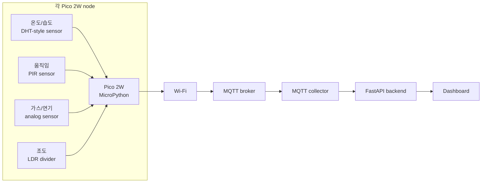

# Pico 2W 실제 센서 배선 가이드

이 문서는 Pico SafeRoom에서 Pico 2W 4대에 실제 센서를 연결하는 방법을 설명합니다.

펌웨어 언어는 **MicroPython**입니다. Python simulator는 `apps/collector/simulator.py`에 따로 있으며, 이 문서는 실제 Pico 2W 하드웨어 전용입니다.

## 장치 설정

가능하면 4개의 Pico 모두 같은 배선을 사용합니다. 각 보드에서는 `config.py`의 `DEVICE_ID`와 `ZONE_ID`만 다르게 설정합니다.

| Board | `DEVICE_ID` | `ZONE_ID` |
| --- | --- | --- |
| Pico 1 | `pico-safe-001` | `room-1` |
| Pico 2 | `pico-safe-002` | `room-2` |
| Pico 3 | `pico-safe-003` | `room-3` |
| Pico 4 | `pico-safe-004` | `room-4` |

## 기본 센서 pin map

| Sensor | Sensor Type | Pico Signal Pin | Power | 전송 단위 |
| --- | --- | --- | --- | --- |
| Temperature | DHT-style digital sensor | `GP16` | `3V3(OUT)` + `GND` | `celsius` |
| Humidity | DHT-style digital sensor | `GP16` | `3V3(OUT)` + `GND` | `%` |
| Motion | PIR digital output | `GP17` | sensor-rated VCC + `GND` | `bool` |
| Gas/smoke | Analog gas module | `ADC0` / `GP26` | sensor-rated VCC + `GND` | `ppm` |
| Light | LDR voltage divider | `ADC1` / `GP27` | `3V3(OUT)` + `GND` | `lux` |

중요: Pico 2W의 GPIO/ADC pin은 **3.3V 전용**입니다. 센서 출력이 5V라면 Pico에 바로 연결하지 말고 level shifter 또는 voltage divider를 사용해야 합니다.

## 실제 배선 그림

아래 그림은 Pico 2W 한 대에 기본 센서를 연결한 예시입니다. 4대 모두 같은 방식으로 연결한 뒤, 각 보드의 `config.py`에서 `DEVICE_ID`, `ZONE_ID`만 바꾸면 됩니다.


## 전체 흐름



## 기본 배선 요약

```text
Pico 2W 3V3(OUT) ----+---- DHT VCC
                     +---- LDR divider top
                     +---- gas sensor VCC only if module supports 3.3V

Pico 2W GND ---------+---- DHT GND
                     +---- PIR GND
                     +---- gas sensor GND
                     +---- LDR divider GND

Pico 2W GP16 ------------- DHT DATA
Pico 2W GP17 ------------- PIR OUT
Pico 2W GP26 / ADC0 ------ gas analog OUT
Pico 2W GP27 / ADC1 ------ light divider signal
```

## Light sensor voltage divider

LDR은 voltage divider 형태로 연결해서 `GP27`에서 analog voltage를 읽습니다.

```text
3V3(OUT)
   |
  LDR
   |
   +------ GP27 / ADC1
   |
  10k resistor
   |
  GND
```

조도 값 방향이 예상과 반대로 움직이면 LDR과 resistor 위치를 바꾸거나 firmware calibration에서 값을 반전하면 됩니다.

## Gas sensor 주의사항

MQ 계열 gas module은 heater 때문에 5V 전원을 사용하는 경우가 많고, analog output도 5V까지 나올 수 있습니다. Pico ADC pin은 5V를 받을 수 없습니다.

안전한 방법:

1. 3.3V compatible gas module만 `3V3(OUT)`에 연결합니다.
2. Gas module analog output과 `GP26` 사이에 voltage divider 또는 level shifter를 둡니다.
3. Pico에 연결하기 전에 analog output이 3.3V를 넘지 않는지 확인합니다.

## MQTT 출력

센서값 topic:

```text
saferoom/{ZONE_ID}/{DEVICE_ID}/sensors/{sensor_id}/reading
```

예시:

```text
saferoom/room-1/pico-safe-001/sensors/gas/reading
```

Heartbeat topic:

```text
saferoom/{ZONE_ID}/{DEVICE_ID}/status
```

## Board별 `config.py`

각 Pico에는 local `config.py`가 필요합니다. Wi-Fi 정보가 있으므로 git에 올리지 않습니다.

Pico 1 예시:

```python
WIFI_SSID = "YOUR_WIFI_SSID"
WIFI_PASSWORD = "YOUR_WIFI_PASSWORD"

MQTT_HOST = "192.168.1.10"
MQTT_PORT = 1883

DEVICE_ID = "pico-safe-001"
ZONE_ID = "room-1"

PUBLISH_INTERVAL_SECONDS = 5

PIN_DHT = 16
PIN_MOTION = 17
PIN_GAS_ADC = 26
PIN_LIGHT_ADC = 27
```

Pico 2는 아래 두 줄만 바꿉니다.

```python
DEVICE_ID = "pico-safe-002"
ZONE_ID = "room-2"
```

Pico 3, Pico 4도 같은 방식입니다.

## 연결 순서

1. Pico 2W에 MicroPython을 설치합니다.
2. `main.py`, `payloads.py`, `sensors.py`, `config.py`를 Pico 파일 시스템에 복사합니다.
3. 먼저 power와 ground만 연결합니다.
4. 센서는 한 번에 하나씩 추가합니다.
5. MQTT broker를 실행합니다.
6. Backend와 MQTT collector를 실행합니다.
7. 한 보드의 MQTT message가 들어오는지 먼저 확인합니다.
8. `/api/readings/latest`에서 실제 값이 보이는지 확인합니다.
9. 나머지 3대도 같은 방식으로 연결합니다.

## Flash 전 software 검증

저장소 루트에서 실행합니다.

```text
.venv/bin/python -m pytest
npm --prefix frontend run build
```

Python test는 MQTT parsing, heartbeat forwarding, simulator 분리, firmware helper 동작을 확인합니다. Frontend build는 dashboard가 정상 compile되는지 확인합니다.

## 문제 해결

| 증상 | 확인할 것 |
| --- | --- |
| MQTT message가 안 들어옴 | Wi-Fi SSID/password, MQTT host IP, broker 실행 여부, 같은 network 여부 |
| Pico가 재시작됨 | 센서 전원 과부하 또는 short 가능성. 센서를 빼고 다시 확인 |
| ADC 값이 계속 최대값 | 센서 출력이 3.3V를 넘거나 배선이 잘못되었을 수 있음 |
| DHT read 실패 | data pin, pull-up resistor, 센서 전원, sensor model 지원 여부 |
| Dashboard에 stale alert 표시 | 센서 또는 보드가 stale threshold 이상 publish하지 않음 |
