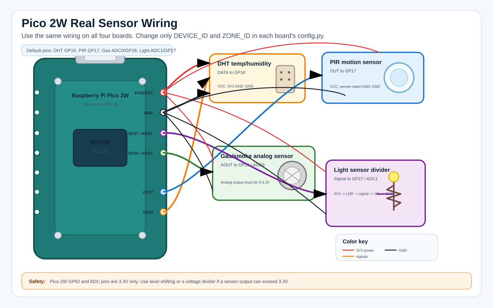
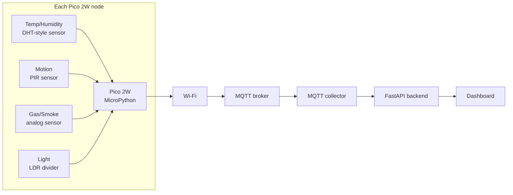

# Pico 2W Real Sensor Wiring Guide

This guide shows the default wiring plan for four real Raspberry Pi Pico 2W sensor nodes in Pico SafeRoom.

The firmware language is **MicroPython**. The Python simulator stays separate in `apps/collector/simulator.py`; this guide is only for real Pico 2W hardware.

## Device Setup

Use the same sensor wiring on each Pico 2W when possible. Change only `DEVICE_ID` and `ZONE_ID` in each board's local `config.py`.

| Board | `DEVICE_ID` | `ZONE_ID` |
| --- | --- | --- |
| Pico 1 | `pico-safe-001` | `room-1` |
| Pico 2 | `pico-safe-002` | `room-2` |
| Pico 3 | `pico-safe-003` | `room-3` |
| Pico 4 | `pico-safe-004` | `room-4` |

## Default Sensor Pin Map

| Sensor | Sensor Type | Pico Signal Pin | Power | Unit Sent |
| --- | --- | --- | --- | --- |
| Temperature | DHT-style digital sensor | `GP16` | `3V3(OUT)` + `GND` | `celsius` |
| Humidity | DHT-style digital sensor | `GP16` | `3V3(OUT)` + `GND` | `%` |
| Motion | PIR digital output | `GP17` | sensor-rated VCC + `GND` | `bool` |
| Gas/smoke | Analog gas module | `ADC0` / `GP26` | sensor-rated VCC + `GND` | `ppm` |
| Light | LDR voltage divider | `ADC1` / `GP27` | `3V3(OUT)` + `GND` | `lux` |

Important: Pico 2W GPIO and ADC pins are **3.3V only**. If a sensor module outputs 5V, use a level shifter or voltage divider before connecting it to the Pico.

## Realistic Wiring Picture

The picture below shows one Pico 2W node wired to the default sensors. Repeat the same wiring for all four boards, then change only `DEVICE_ID` and `ZONE_ID` in each board's `config.py`.



## System Visual



## Pico Pin Visual

Simplified top-view map for the default wiring:

```text
                 Raspberry Pi Pico 2W
              USB connector at the top

        left side                         right side
   +-----------------+               +-----------------+
   | GP0             |               | VBUS            |
   | GP1             |               | VSYS            |
   | GND             |               | GND             |
   | GP2             |               | 3V3_EN          |
   | GP3             |               | 3V3(OUT)  ---> sensor VCC
   | GP4             |               | ADC_VREF        |
   | GP5             |               | GP28 / ADC2     |
   | GND             |               | GND       ---> sensor GND
   | GP6             |               | GP27 / ADC1 ---> light analog
   | GP7             |               | GP26 / ADC0 ---> gas analog
   | GP8             |               | RUN             |
   | GP9             |               | GP22            |
   | GND             |               | GND             |
   | GP10            |               | GP21            |
   | GP11            |               | GP20            |
   | GP12            |               | GP19            |
   | GP13            |               | GP18            |
   | GND             |               | GND             |
   | GP14            |               | GP17      ---> motion data
   | GP15            |               | GP16      ---> temp/humidity data
   +-----------------+               +-----------------+
```

## Wiring Visual

```text
Pico 2W 3V3(OUT) ----+---- DHT VCC
                     +---- LDR divider top
                     +---- gas sensor VCC only if module supports 3.3V

Pico 2W GND ---------+---- DHT GND
                     +---- PIR GND
                     +---- gas sensor GND
                     +---- LDR divider GND

Pico 2W GP16 ------------- DHT DATA
Pico 2W GP17 ------------- PIR OUT
Pico 2W GP26 / ADC0 ------ gas analog OUT
Pico 2W GP27 / ADC1 ------ light divider signal
```

## Light Sensor Divider

Use the LDR as a voltage divider so Pico reads an analog voltage on `GP27`.

```text
3V3(OUT)
   |
  LDR
   |
   +------ GP27 / ADC1
   |
  10k resistor
   |
  GND
```

If the light value moves in the opposite direction from what you expect, swap the LDR and resistor positions or invert the value in firmware calibration.

## Gas Sensor Safety Note

Many MQ-series gas modules are designed for 5V heater power and may output up to 5V on analog output. Pico ADC pins cannot accept 5V.

Use one of these safe options:

1. Power a 3.3V-compatible gas module from `3V3(OUT)`.
2. Use a voltage divider or level-shifting circuit between the gas module analog output and `GP26`.
3. Confirm the module analog output never exceeds 3.3V before connecting it to the Pico.

## MQTT Output

Each sensor reading publishes to:

```text
saferoom/{ZONE_ID}/{DEVICE_ID}/sensors/{sensor_id}/reading
```

Example:

```text
saferoom/room-1/pico-safe-001/sensors/gas/reading
```

Each heartbeat publishes to:

```text
saferoom/{ZONE_ID}/{DEVICE_ID}/status
```

## Per-Board `config.py`

Each Pico gets its own local `config.py`. Do not commit this file because it contains Wi-Fi details.

Example for Pico 1:

```python
WIFI_SSID = "YOUR_WIFI_SSID"
WIFI_PASSWORD = "YOUR_WIFI_PASSWORD"

MQTT_HOST = "192.168.1.10"
MQTT_PORT = 1883

DEVICE_ID = "pico-safe-001"
ZONE_ID = "room-1"

PUBLISH_INTERVAL_SECONDS = 5

PIN_DHT = 16
PIN_MOTION = 17
PIN_GAS_ADC = 26
PIN_LIGHT_ADC = 27
```

For Pico 2, change only:

```python
DEVICE_ID = "pico-safe-002"
ZONE_ID = "room-2"
```

Repeat the same pattern for Pico 3 and Pico 4.

## Bring-Up Checklist

1. Flash MicroPython for Raspberry Pi Pico 2W.
2. Copy `main.py`, `payloads.py`, `sensors.py`, and `config.py` to the Pico filesystem.
3. Wire only power and ground first.
4. Add one sensor at a time.
5. Start the MQTT broker.
6. Start the backend and MQTT collector.
7. Watch MQTT messages for one board before wiring all four.
8. Confirm `/api/readings/latest` shows the real board values.

## Software Validation Before Flashing

Run these from the repository root:

```text
.venv/bin/python -m pytest
npm --prefix frontend run build
```

The Python tests verify MQTT parsing, heartbeat forwarding, simulator separation, and host-testable firmware helper behavior. The frontend build verifies the dashboard still compiles.

## Troubleshooting

| Symptom | Check |
| --- | --- |
| No MQTT messages | Wi-Fi SSID/password, MQTT host IP, broker running, same network. |
| Pico restarts | Sensor power draw or short circuit; disconnect sensors and retry. |
| ADC value stuck at max | Sensor output may exceed 3.3V or wiring may be wrong. |
| DHT read fails | Data pin, pull-up resistor, sensor power, and sensor model support. |
| Dashboard shows stale alert | The sensor or board stopped publishing for more than the stale threshold. |
